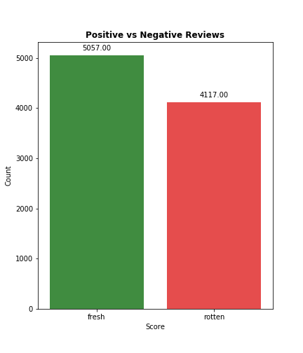
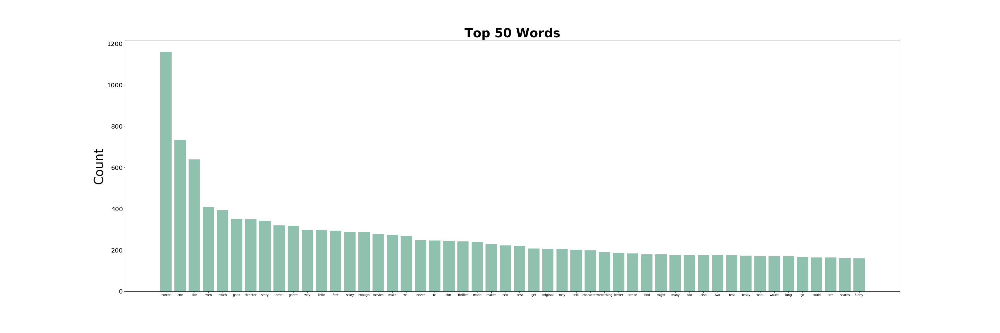
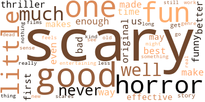

# Movie Review Classifier

Gabriela Lopez

Sources: IMDB & Rotten Tomatoes

## Table of Contents

1. [Introduction](#intro)
    1. [Business Case](#case)
    2. [Libraries Used](#lib)
    3. [File Index](#files)
    4. [Presentation Link](#pp)
2. [Data Collection](#data)
3. [Data Cleaning & EDA](#eda)
4. [Modeling](#model)
    1. [Baseline](#base)
    2. [Final](#final)
5. [Conclusion](#end)
    1. [Results](#res)
    2. [Recommendations](#rec)

# Introduction 

## Business Case 

My goal with this project is to use movie review data scraped from Rotten Tomatoes to build a sentiment classifier. This is a common NLP task, and a good way to practice working with text data. 

## Libraries Used 

This project uses the following python libraries.

#### Data Collection
* BeautifulSoup
* requests
* time
* pandas

#### Cleaning and EDA

* pandas
* nltk
* matplotlib
* seaborn
* string
* wordcloud
* numpy

#### Modeling

* pandas
* matplotlib
* sklearn
* custom

#### Custom Functions

* matplotlib
* numpy
* pandas
* sklearn
* xgboost
* itertools

## File Index 

#### Images/
Stores visualizations

#### Notebooks_and_Code/
Stores jupyter notebooks and python files with custom functions.

**Data_Collection.ipynb**: This workbook scrapes IMDB to create a list of movies for a given genre, and then Rotten Tomatoes for reviews for those movies.

**Cleaning_and_EDA.ipynb**: This workbook cleans and preprocesses the collected data so it is ready for modeling.

**Modeling.ipynb**: This workbook contains the model creation.

**custom.py**: This file contains my custom functions for creating and evaluating classifiers.

## Presentation Link 

# Data Collection 

First, I collected a list of the top 1,000 movies of the horror genre from IMDB. I scraped all top critic reviews for every movie on this list from Rotten Tomatoes. The reviews and their scores were put into a dataframe. 

# Data Cleaning & EDA 

Next, we took a look at our starting dataframe. Each row contained a review and its given score, "fresh" for positive and "rotten" for negative. There are 9,174 reviews.

I want to make sure there is no class imbalance, so I check our class distribution.

We can see there is a 55:45 split, with "fresh" being the majority class. This is an almost even distribution, so we don't have to worry about class imbalance ruining our models.

We can now tokenize our reviews and change the scores to be a numerical representation, 1 for "fresh" and 0 for "rotten".

Then we remove our stopwords from the tokenized reviews and look at our 50 most common words for all reviews.
    

# Modeling 

Now that we are ready to model, we take our original review data, pass it into a TFIDF vectorizer, and split this into a train and test set.

Our baseline model predicts the majority class, giving us an accuracy and precision of 55%, and recall of 1 (obviously). 

## Baseline 

## Final 

# Conclusion 

## Results 

## Recommendations 