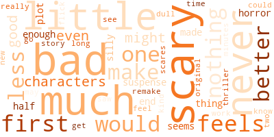
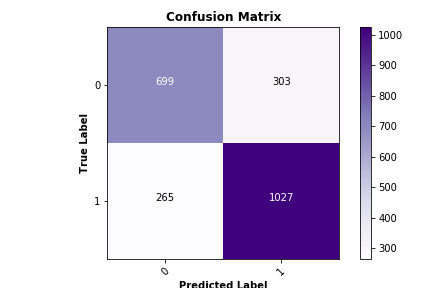

# Movie Review Classifier

Gabriela Lopez

Sources: IMDB & Rotten Tomatoes

## Table of Contents

1. [Introduction](#intro)
    1. [Business Case](#case)
    2. [Libraries Used](#lib)
    3. [File Index](#files)
    4. [Presentation Link](#pp)
2. [Data Collection](#data)
3. [Data Cleaning & EDA](#eda)
4. [Modeling](#model)
    1. [Baseline](#base)
    2. [Final](#final)
        1. [Misclassifications](#mis)
5. [Conclusion](#end)
    1. [Recommendations](#rec)

# Introduction 

## Business Case 

My goal with this project is to use movie review data scraped from Rotten Tomatoes to build a sentiment classifier. This is a common NLP task, and a good way to practice working with text data.

A sentiment classifier can be used for quickly and automatically marking movie reviews as positive or negative. The scope of this project is only for a specific genre of movies, but the classifier could be used for reviews collected from any source. Meaning this can be useful for any movie website who wants to automate their review or movie classification process.

## Libraries Used 

This project uses the following python libraries.

#### Data Collection
* BeautifulSoup
* requests
* time
* pandas

#### Cleaning and EDA

* pandas
* nltk
* matplotlib
* seaborn
* string
* wordcloud
* numpy

#### Modeling

* pandas
* matplotlib
* sklearn
* custom

#### Custom Functions

* matplotlib
* numpy
* pandas
* sklearn
* xgboost
* itertools

## File Index 

#### Images/
Stores visualizations

#### Notebooks_and_Code/
Stores jupyter notebooks and python files with custom functions.

**Data_Collection.ipynb**: This workbook scrapes IMDB to create a list of movies for a given genre, and then Rotten Tomatoes for reviews for those movies.

**Cleaning_and_EDA.ipynb**: This workbook cleans and preprocesses the collected data so it is ready for modeling. It also creates visualizations making it easier to describe the statistics of our data. 

**Modeling.ipynb**: This workbook contains the model creation.

**custom.py**: This file contains my custom functions for creating and evaluating classifiers.

## Presentation Link 

# Data Collection 

First, I collected a list of the top 1,000 movies of the horror genre from IMDB. I scraped all top critic reviews for every movie on this list from Rotten Tomatoes. The reviews and their scores were put into a dataframe. 

# Data Cleaning & EDA 

Next, I took a look at our starting dataframe. Each row contained a review and its given score, "fresh" for positive and "rotten" for negative. There are 9,174 reviews.

I want to make sure there is no class imbalance, so I check our class distribution.

There is a 55:45 split, with "fresh" being the majority class. This is an almost even distribution, so I don't have to worry about class imbalance ruining my models.

Next, I changed the scores to be a numerical representation, 1 for "fresh" and 0 for "rotten", created a list of stop words, and vectorized the data using TF-IDF vectorization. 

I was then able to visualize some statistics of the data. Below are the 25 most important words across all reviews.

Then we can separate these into most important words among each class, 0 being negative and 1 being positive reviews. As could be expected, the top word for negative reviews is "bad", and for positive reviews is "good".

Lastly, we create some word clouds with this data. 

  

# Modeling 

Now that the data is ready to model, I split this into a train and test set and pass it into a baseline model.

This predicts the majority class, giving us an accuracy and precision of 56%, F1 score of 72 and recall of 1 (obviously). 

## Initial 

To start off, I created the following 9 classification models using just the models' default parameters.

* Logistic Regression
* KNN
* Decision Tree
* Random Forest
* XGB
* AdaBoost
* Gradient Boosting
* SVC
* Multinomial NB

Out of these, I picked the top 3 performing models.

* Logistic Regression
    * Accuracy = 0.73
    * F1 = 0.79
* SVC
    * Accuracy = 0.74
    * F1 = 0.80
* Multinomial NB
    * Accuracy = 0.72
    * F1 = 0.79

## Final 

To get better results, I ran a grid search on these top 3 to find the best parameters. Out of these, the best model was SVC with a regularization parameter of 2 and a sigmoid kernel.

* Final SVC Model
    * Accuracy = 0.75
    * F1 = 0.78

 

The AUC shows this model has a 75% chance of distinguishing between negative and positive reviews. The red line shows the ROC curve of a no-skill classifier, which would predict a class randomly and have an AUC of 0.5. This shows this model is better than random chance.

### Misclassifications 

As a last effort to improve on my model, I wanted to look at which documents were misclassified. I found the top 25 words for these and compared it to the most important words per class of review.

From this, I can't see an obvious reason why these documents were misclassified. The top words for those falsely classified as negative seem to match a lot of the the top words expected in positive reviews. As next steps, further analysis could be done on these.

# Conclusion 

I was able to get a pretty accurate model from a good amount of movie reviews. This sentiment analysis can be used to classify reviews quickly and automatically.

The scope of this project is only for a specific genre of movies, but this classifier could be used for reviews collected from any source. This would be useful for any movie website wanting to automate their review or movie classification process.

## Future Recommendations 

* Add more complex models to achieve a higher accuracy.
* Gather more data for this genre or from different movie genres.
* Gather crowdsourced data, such as any mention of a specific movie on twitter.
* Build classifier to distinguish betweeen movie genres using this data.
* Further feature engineering, such as trigrams and lemmatization.
* Analyze misclassifications further.
